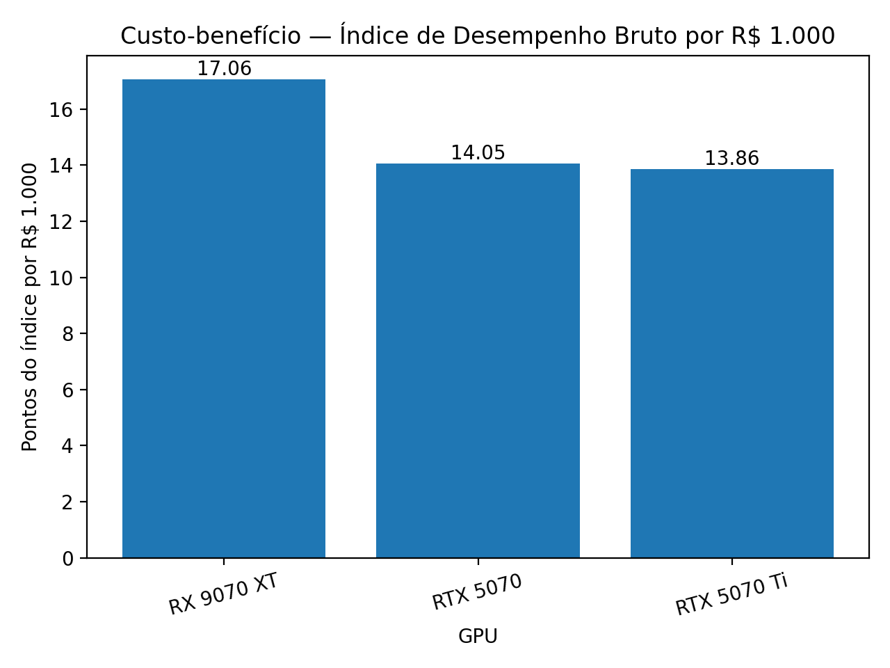

# Meu Primeiro Projeto de Dados

## Dados utilizados (recorte)

| GPU | Preço (R$) | Time Spy (Graphics) | OpenCL | Vulkan |
|---|---:|---:|---:|---:|
| RTX 5070 | 4599 | 15731 | 187414 | 188712 |
| RTX 5070 Ti | 6999 | 48656 | 229140 | 228576 |
| RX 9070 XT | 4999 | 53403 | 179178 | 177395 |

> Os preços representam uma coleta pontual do mercado brasileiro. Os benchmarks foram coletados de fontes públicas e serão referenciados na seção de fontes.

## Resultados

### Métrica principal: Índice por R$ 1.000
Para comparar custo-benefício entre GPUs de forma padronizada, foi criado um **Índice de Desempenho Bruto** com base em três benchmarks (Time Spy DX12, OpenCL e Vulkan). Como os testes possuem escalas diferentes, os scores foram normalizados (melhor resultado em cada teste = 100) e combinados em uma média.

A métrica usada para custo-benefício foi:

**Índice por R$ 1.000 = (Índice de Desempenho Bruto / Preço) × 1000**

Quanto maior esse valor, **mais desempenho bruto o consumidor recebe por R$ 1.000 investidos**.

### Principais achados
- Considerando os preços coletados e os benchmarks utilizados, a **RX 9070 XT** apresentou o maior **Índice por R$ 1.000**, liderando em custo-benefício no cenário de **desempenho bruto**.
- A **RTX 5070 Ti**, apesar de alto desempenho, ficou atrás em custo-benefício no preço considerado.
- A **RTX 5070** ficou em posição inferior no índice agregado, indicando menor retorno de desempenho por real investido dentro deste recorte.

> Observação: este projeto mede **desempenho bruto/sintético** e não considera tecnologias e otimizações em jogos como **DLSS/Frame Generation (NVIDIA)** e **FSR (AMD)**. Em jogos reais, os resultados podem variar conforme título, resolução e configurações.
> 
> # “No recorte analisado, a RX 9070 XT entrega mais desempenho bruto por R$ 1.000 investidos, enquanto a RTX 5070 Ti apresenta alto desempenho absoluto, porém menor retorno por real no preço considerado.”
> # Contexto de mercado

Popularidade na base gamer (Steam)

A pesquisa mensal de hardware do Steam (jan/2026) mostra que GPUs NVIDIA representam ~73,24%, AMD ~18,44% e Intel ~7,94% do uso reportado.
(E na lista de GPUs mais usadas aparecem modelos como RTX 4060 e RTX 3060 no topo.)

Por que se fala que a NVIDIA está “focada em IA”

Nos resultados financeiros da NVIDIA (Q3 do ano fiscal 2026), a receita de Data Center foi reportada em US$ 51,2B, enquanto Gaming foi US$ 4,3B — indicando o peso enorme da demanda de infraestrutura de IA no negócio atual da empresa.
📓 Notebook completo com código, tabelas e gráficos:  
👉 [analise_gpus_preco_performance.ipynb](https://colab.research.google.com/drive/1Z71KbuVUGgdkKJ5rv15v3sH9_Qo4MS5E)
